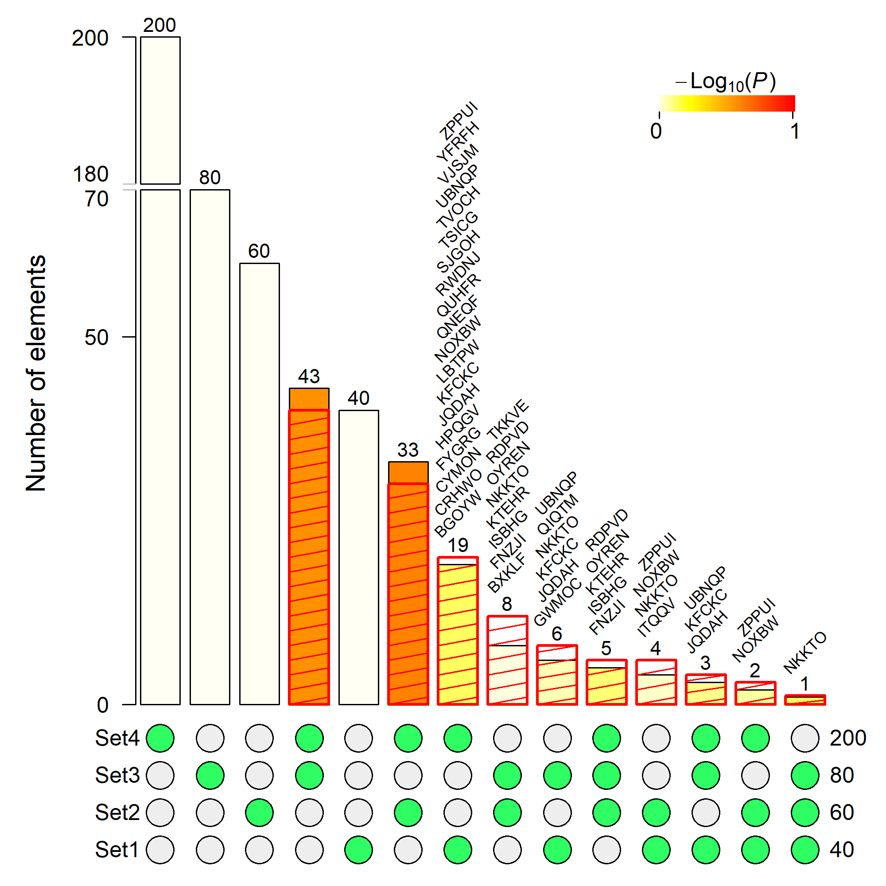
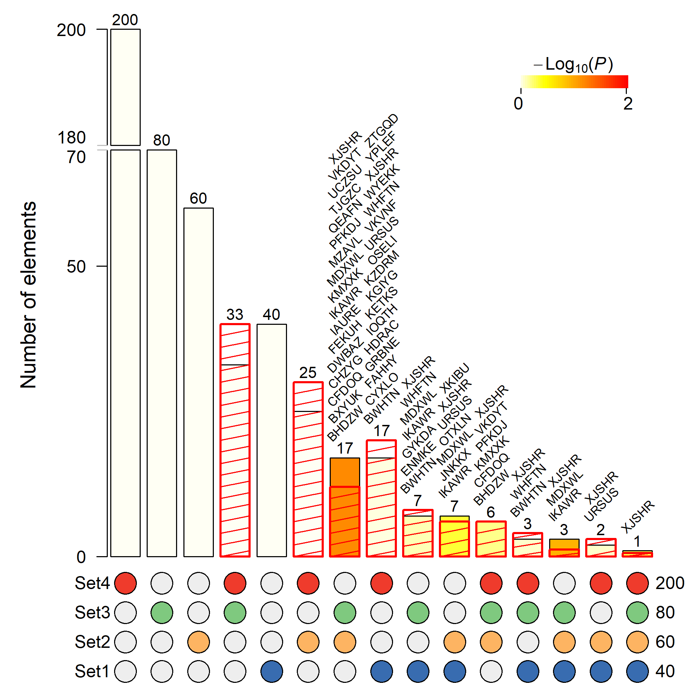
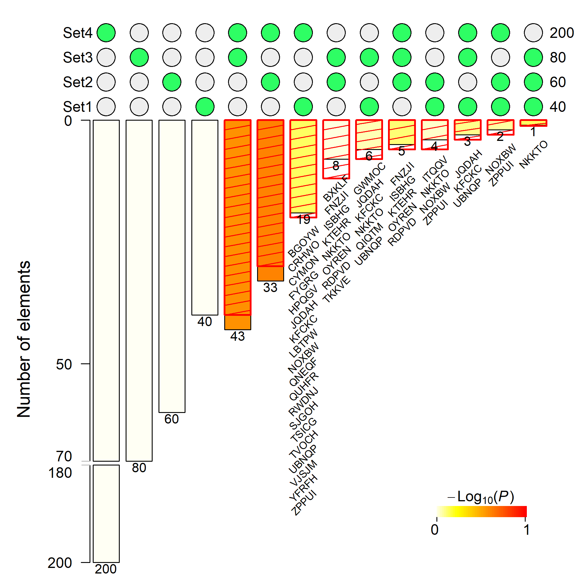
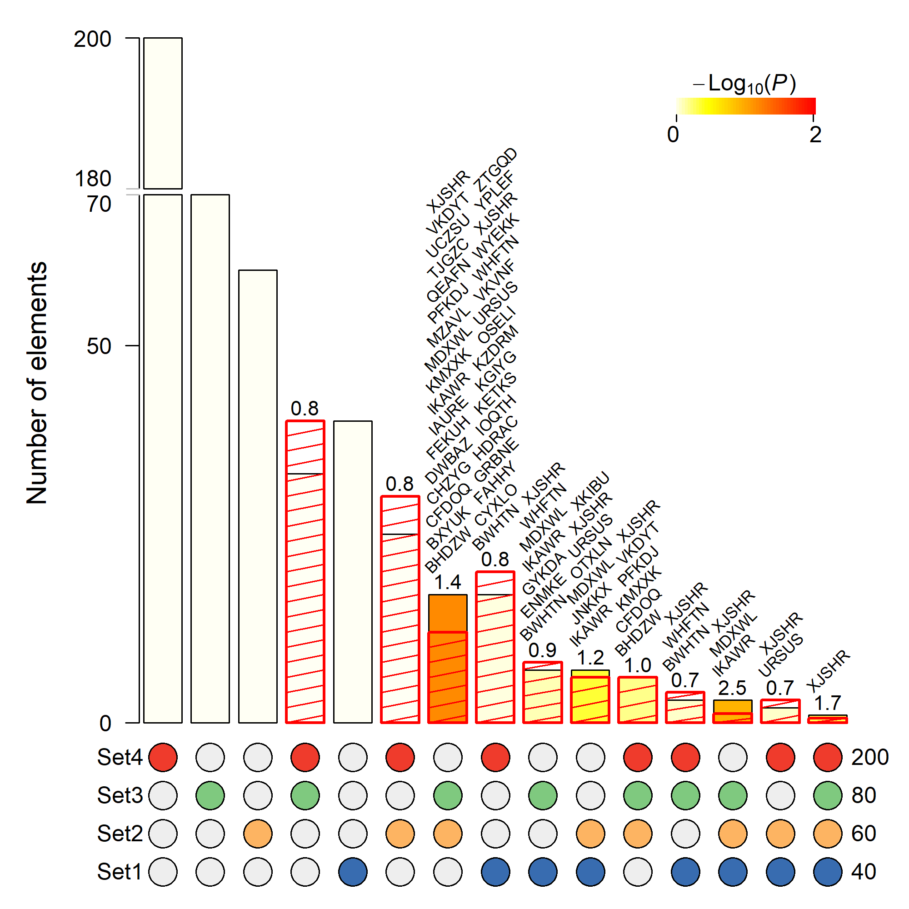

## SuperExactTest [](https://cran.r-project.org/package=SuperExactTest) [](http://www.r-pkg.org/pkg/SuperExactTest) [](http://www.r-pkg.org/pkg/SuperExactTest)

#### Current version 1.0.7

### Description
`SuperExactTest` is an R package for statistical testing and visualization of mult-set intersections.

### Installation
`SuperExactTest` is available from `CRAN` so the simplest way to install in `R` is by running `install.packages("SuperExactTest")`.

To install the latest update from here in `github`, run `devtools::install_github("mw201608/SuperExactTest")` in `R`.

### Reference
[Minghui Wang, Yongzhong Zhao, and Bin Zhang (2015) Efficient Test and Visualization of Multi-Set Intersections. *Scientific Reports* 5: 16923.](https://www.nature.com/articles/srep16923)

### Vignette
Detailed description about the package and sample analysis code is available from `vignette("set_html",package="SuperExactTest")` ([link](examples/set_html.Md)) after installation.

### Example
```
library(SuperExactTest)
set.seed(1234)
#generate random strings
n=400
r_strings <- do.call(paste0, replicate(5, sample(LETTERS, n, TRUE), FALSE))
input=lapply(c(40,60,80,200),function(x,s) sample(s,x),s=r_strings)
Result=supertest(input,n=n)
#plot the intersections with a split y-axis
#show elements of the intersections with no more than 20 elements
#png('examples/ex1.png',width=2000,height=2000,res=300)
plot(Result, Layout="landscape", sort.by="size", keep=FALSE,
	bar.split=c(70,180), show.elements=TRUE, elements.cex=0.7,
	elements.list=subset(summary(Result)$Table,Observed.Overlap <= 20),
	show.expected.overlap=TRUE,expected.overlap.style="hatchedBox",
	color.expected.overlap='red')
#dev.off()
```


As of version 1.0.7, we can change the order of the intersection bars in a customized way through option `sort.by`.
For example, let us switch the orders of the fourth and fifth bars in the above figure.
```
#First extract the intersection barcodes ordered by size
order1=names(sort(Result$overlap.sizes,decreasing=TRUE))
#Then switch the orders of the fourth and fifth element
order2=order1[c(1:3,5,4,6:length(order1))]
print(order1)
print(order2)
#Now plot with the new order
#png('examples/ex2.png',width=2000,height=2000,res=300)
plot(Result, Layout="landscape", sort.by=order2, keep=FALSE,
        bar.split=c(70,180), show.elements=TRUE, elements.cex=0.7,
        elements.list=subset(summary(Result)$Table,Observed.Overlap <= 20),
        show.expected.overlap=TRUE,expected.overlap.style="hatchedBox",
        color.expected.overlap='red')
#dev.off()
```


We can also flip the bars upside down using option flip.vertical=TRUE.
```
#First extract the intersection barcodes ordered by size
order1=names(sort(Result$overlap.sizes,decreasing=TRUE))
#Then switch the orders of the fourth and fifth element
order2=order1[c(1:3,5,4,6:length(order1))]
print(order1)
print(order2)
#Now plot with the new order
#png('examples/ex3.png',width=2000,height=2000,res=300)
plot(Result, Layout="landscape", sort.by=order2, keep=FALSE,
        bar.split=c(70,180), show.elements=TRUE, elements.cex=0.7,
        elements.list=subset(summary(Result)$Table,Observed.Overlap <= 20),
        show.expected.overlap=TRUE,expected.overlap.style="hatchedBox",
        color.expected.overlap='red',flip.vertical=TRUE)
#dev.off()
```



Show fold enrichment on top of the bars by tricking `show.elements` and `elements.list` options.
```
t1=data.frame(Elements=Result$overlap.sizes/Result$overlap.expected,row.names=names(Result$overlap.sizes),stringsAsFactors=FALSE)
t1=t1[!is.na(t1$Elements),,drop=FALSE]
t1$Elements=sprintf("%.1f",t1$Elements)
#png('examples/ex4.png',width=2000,height=2000,res=300)
plot(Result, Layout="landscape", sort.by=order2, keep=FALSE,
        bar.split=c(70,180), show.elements=TRUE, elements.cex=1,
		show.overlap.size=FALSE,
		elements.list=t1,elements.rot=0,
        show.expected.overlap=TRUE,expected.overlap.style="hatchedBox",
        color.expected.overlap='red')
#dev.off()

