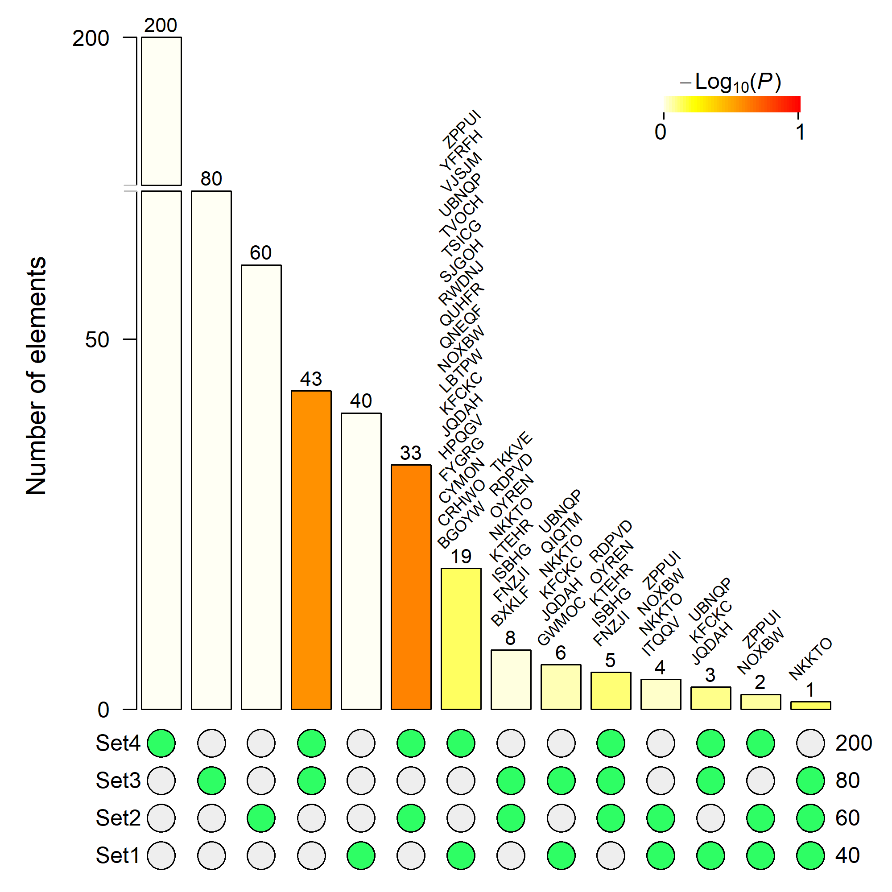

## SuperExactTest [](https://cran.r-project.org/package=SuperExactTest) [](http://www.r-pkg.org/pkg/SuperExactTest)

#### Current version 1.0.2

### Description
`SuperExactTest` is an R package for statistical testing and visualization of mult-set intersections.

### Installation
`SuperExactTest` is available from `CRAN` so the simplest way to install in `R` is by running `install.packages("SuperExactTest")`.

However, the one on `CRAN` may be some versions behind the current development. To install the latest update from here in `github`, run `devtools::install_github("mw201608/SuperExactTest")` in `R`.


### Reference
Minghui Wang, Yongzhong Zhao, and Bin Zhang (2015) Efficient Test and Visualization of Multi-Set Intersections. *Scientific Reports* 5: 16923.


### Example
```
set.seed(1234)
#generate random strings
n=400
r_strings <- do.call(paste0, replicate(5, sample(LETTERS, n, TRUE), FALSE))
input=lapply(c(40,60,80,200),function(x,s) sample(s,x),s=r_strings)
Result=supertest(input,n=n)
#plot the intersection with a split y-axis
#show elements of the intersections whose size is no larger than 20
plot(Result, Layout="landscape", sort.by="size", keep=FALSE,
	bar.split=c(70,180), show.elements=TRUE, elements.maximum=20,
	elements.cex=0.7, x.pos=c(0.1,0.95), y.pos=c(0.025,0.95))
```

