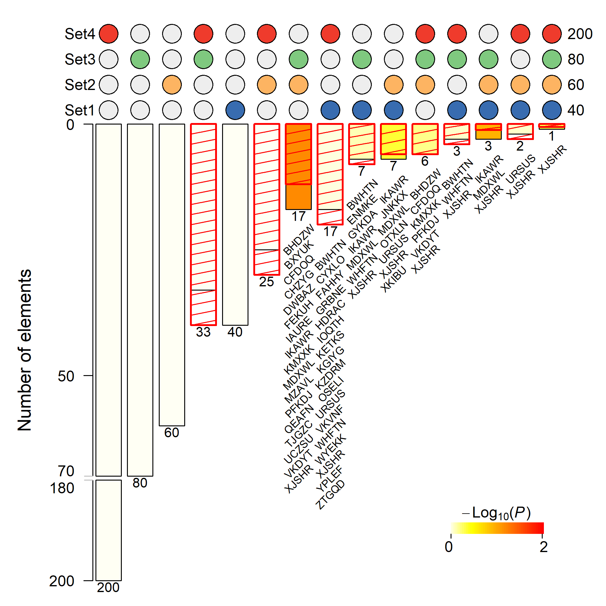

## SuperExactTest [](https://cran.r-project.org/package=SuperExactTest) [](http://www.r-pkg.org/pkg/SuperExactTest) [](http://www.r-pkg.org/pkg/SuperExactTest)

#### Current version 1.1.1

### Description
`SuperExactTest` is an R package for statistical testing and visualization of mult-set intersections.

### Installation
`SuperExactTest` is available from `CRAN` so the simplest way to install in `R` is by running `install.packages("SuperExactTest")`.

To install the latest update from here in `github`, run `devtools::install_github("mw201608/SuperExactTest")` in `R`.

### Reference
[Minghui Wang, Yongzhong Zhao, and Bin Zhang (2015) Efficient Test and Visualization of Multi-Set Intersections. *Scientific Reports* 5: 16923.](https://www.nature.com/articles/srep16923)

### Vignette
Detailed description about the package and sample analysis code is available from `vignette("set_html",package="SuperExactTest")` ([link](examples/set_html.Md)) after installation.

### SuperExactTest shiny
A shiny application has been deployed at [shinyapps.io](https://network.shinyapps.io/SuperExactTest/) (see also [github](https://github.com/mw201608/SuperExactTest.shiny)), allowing users to run and visualize `SuperExactTest` analysis online.

### Examples
#### 1 Show selected overlapping elements
```
library(SuperExactTest)
set.seed(1234)
#generate random strings
n=400
r_strings <- do.call(paste0, replicate(5, sample(LETTERS, n, TRUE), FALSE))
input=lapply(c(40,60,80,200),function(x,s) sample(s,x),s=r_strings)
Result=supertest(input,n=n)
#Plot the intersections with a split y-axis and 
#show elements of the intersections with no more than 20 elements
#png('examples/ex1.png',width=2000,height=2000,res=300)
plot(Result, Layout="landscape", sort.by="size", keep=FALSE,
	bar.split=c(70,180), show.elements=TRUE, elements.cex=0.7,
	elements.list=subset(summary(Result)$Table,Observed.Overlap <= 20),
	show.expected.overlap=TRUE,expected.overlap.style="hatchedBox",
	color.expected.overlap='red')
#dev.off()
```


Assign discrete colors to denote the sets that are involved in each intersection by setting `color.on` to NULL or a vector of colors.
```
#png('examples/ex1color.png',width=2000,height=2000,res=300)
plot(Result, Layout="landscape", sort.by="size", keep=FALSE,
	bar.split=c(70,180), show.elements=TRUE, elements.cex=0.7,
	elements.list=subset(summary(Result)$Table,Observed.Overlap <= 20),
	show.expected.overlap=TRUE,expected.overlap.style="hatchedBox",
	color.expected.overlap='red', color.on = NULL)
#dev.off()
```


#### 2 Sort intersection bars
As of version 1.0.7, we can change the order of the intersection bars in a customized way through option `sort.by`.
For example, let us switch the orders of the fourth and fifth bars in the above figure.
```
#First extract the intersection barcodes ordered by size
order1=names(sort(Result$overlap.sizes,decreasing=TRUE))
#Then switch the orders of the fourth and fifth element
order2=order1[c(1:3,5,4,6:length(order1))]
print(order1)
print(order2)
#Now plot with the new order
#png('examples/ex2.png',width=2000,height=2000,res=300)
plot(Result, Layout="landscape", sort.by=order2, keep=FALSE,
        bar.split=c(70,180), show.elements=TRUE, elements.cex=0.7,
        elements.list=subset(summary(Result)$Table,Observed.Overlap <= 20),
        show.expected.overlap=TRUE,expected.overlap.style="hatchedBox",
        color.expected.overlap='red', color.on = NULL)
#dev.off()
```


#### 3 Flip the bards upside down
We can also flip the bars upside down using option flip.vertical=TRUE.
```
#png('examples/ex3.png',width=2000,height=2000,res=300)
plot(Result, Layout="landscape", sort.by=order2, keep=FALSE,
        bar.split=c(70,180), show.elements=TRUE, elements.cex=0.7,
        elements.list=subset(summary(Result)$Table,Observed.Overlap <= 20),
        show.expected.overlap=TRUE,expected.overlap.style="hatchedBox",
        color.expected.overlap='red', color.on = NULL, flip.vertical=TRUE)
#dev.off()
```


#### 4 Show fold enrichment
Show fold enrichment rather than overlp size on top of the bars (since v1.0.7.1).
```
#png('examples/ex4.png',width=2000,height=2000,res=300)
plot(Result, Layout="landscape", sort.by=order2, keep=FALSE,
        bar.split=c(70,180), show.elements=TRUE, elements.cex=0.7,
		show.fold.enrichment=TRUE,
		elements.list=subset(summary(Result)$Table,Observed.Overlap <= 20),elements.rot=45,
        show.expected.overlap=TRUE,expected.overlap.style="hatchedBox",
        color.expected.overlap='red', color.on = NULL)
#dev.off()
```


#### 5 Place multiple SuperExactTest plots on the same page
We can combine multiple SuperExactTest plots on the same page by setting new.gridPage = FALSE. For example, to arrange two SuperExactTest figures side by side, we can:
```
#png('examples/ex5.png',width=4000,height=2000,res=300)
grid.newpage()
vp0 <- viewport(layout = grid.layout(1, 2))
vp1 <- viewport(layout.pos.col = 1, layout.pos.row = 1, name = "plot_left")
vp2 <- viewport(layout.pos.col = 2, layout.pos.row = 1, name = "plot_right")
vps <- vpTree(vp0, vpList(vp1, vp2))
pushViewport(vps)
seekViewport("plot_left")
plot(Result, Layout="landscape", sort.by='size', keep=FALSE,
        bar.split=c(70,180), show.fold.enrichment=TRUE,
        show.expected.overlap=TRUE, expected.overlap.style="hatchedBox",
        color.expected.overlap='red', color.on = NULL,
        title = 'Figure A. Landscape layout', new.gridPage = FALSE)
seekViewport("plot_right")
plot(Result, Layout="circular", sort.by='size', keep=FALSE,
        show.expected.overlap=TRUE,expected.overlap.style="hatchedBox",
        color.expected.overlap='red', color.on = NULL,
        title = 'Figure B. Circular layout', new.gridPage = FALSE)
#dev.off()
```

