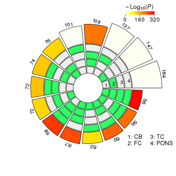
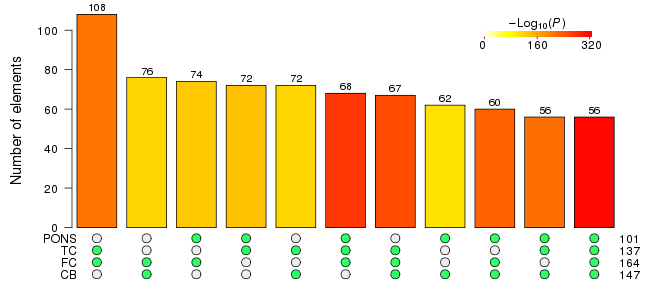

## Scope

This guide provides an overview of using the `R` package `SuperExactTest` for statistical testing and visualization of mult-set intersections.
In this package, we implemented a theoretical framework for computing the exact statistical distributions of multi-set intersections (Wang et al 2015).
Utilizing a forward algorithm based procedure with the computational complexity linear to the number of sets, we are able to efficiently calculate the intersection probability among a large number of sets.
Multiple efficient and scalable visualization techniques are provided for illustrating multi-set intersections and the corresponding intersection statistics.

## Citing `SuperExactTest`
If you use the `SuperExactTest` package, please cite the following paper:

Minghui Wang, Yongzhong Zhao, and Bin Zhang (2015) Efficient Test and Visualization of Multi-Set Intersections. _Scientific Reports_ 5: 16923.

## Case study

We demonstrate the utility of the package through analyzing multiple sets of expression quantitative trait loci (eQTLs) identified from several tissues.
eQTLs are the genomic loci (as represented by genetic variants in practice) that regulate the gene expression.
Identifying expression regulators is considered a powerful tool in dissecting the architecture of the genetics of disease and other complex phenotypes.
It is widely believed that the gene expression regulation are both spatially (cell-type and tissue specificity) and temporally (different developmental stages).

As an example, we downloaded four sets of genes with *cis*-eQTLs (i.e. gene expression regulated by local genetic variants) detected in four different brain regions (Gibbs et al 2010)
which had been deposited in the eQTL Browser database (http://www.ncbi.nlm.nih.gov/projects/gap/eqtl/index.cgi) and performed statistical analyses of the intersections among the gene sets.
For convenience, we pre-compiled the *cis*-eQTL genes into a list which has been included in the present package. After loading the package, the pre-compiled dataset can be imported as follows:

```r
library("SuperExactTest")
```

```
## Loading required package: grid
```

```
## 
## Attaching package: 'SuperExactTest'
```

```
## The following objects are masked from 'package:base':
## 
##     intersect, union
```

```r
data("eqtls")
```
The loaded data object is a list called `cis.eqtls` which contains four vectors of gene symbols. To check the structure of the imported object, we can use command:

```r
str(cis.eqtls)
```

```
## List of 4
##  $ CB  : chr [1:147] "KCTD10" "CHURC1" "C10orf85" "AMFR" ...
##  $ FC  : chr [1:164] "CHURC1" "KCTD10" "AMFR" "SCG3" ...
##  $ TC  : chr [1:137] "CHURC1" "SCG3" "AMFR" "KCTD10" ...
##  $ PONS: chr [1:101] "CHURC1" "KCTD10" "PEX6" "HMBOX1" ...
```
The names of the gene sets preserve the brain tissue information: CB (cerebellum), FC (frontal cortex), TC (temporal cortex) and PONS (pons region).
It needs to be stressed that these *cis*-eQTL gene sets were detected from genome-wide gene expression profiling of 18,196 unique genes (Gibbs et al 2010).

The length of the *cis*-eQTL gene sets varies from 101 to 164:

```r
(length.gene.sets=sapply(cis.eqtls,length))
```

```
##   CB   FC   TC PONS 
##  147  164  137  101
```
Assuming the *cis*-eQTL gene sets were independently and randomly sampled from the population of 18,196 unique genes profiled in the eQTL study,
the probability of the number of common genes shared by the four *cis*-eQTL gene sets can be computed using function `dpsets`
which implements the exact probability calculation of multi-set intersection developed in this study.
Before we perform the statistical test of the intersection among the four gene sets, let us firstly calculate the expected overlap size:

```r
total=18196
(num.expcted.overlap=total*do.call(prod,as.list(length.gene.sets/total)))
```

```
## [1] 5.53701e-05
```
Due to the large background population gene size whereas small gene set sizes, the expected intersection size is close to 0.
It is obvious that the possible number of genes shared among the four *cis*-eQTL gene sets is from 0 to 101.
We can compute the probability density distribution of the possible intersection sizes using the `dpsets` function:

```r
(p=sapply(0:101,function(i) dpsets(i, length.gene.sets, n=total)))
```

```
##   [1]  9.999446e-01  5.536713e-05  1.487462e-09  2.584596e-14  3.266929e-19
##   [6]  3.203379e-24  2.537574e-29  1.669915e-34  9.317026e-40  4.476026e-45
##  [11]  1.874211e-50  6.907188e-56  2.258521e-61  6.596148e-67  1.730423e-72
##  [16]  4.097358e-78  8.793254e-84  1.716552e-89  3.057708e-95 4.983934e-101
##  [21] 7.451607e-107 1.024173e-112 1.296529e-118 1.514351e-124 1.634467e-130
##  [26] 1.632415e-136 1.510523e-142 1.296427e-148 1.033055e-154 7.649616e-161
##  [31] 5.267943e-167 3.376250e-173 2.015080e-179 1.120610e-185 5.809401e-192
##  [36] 2.808707e-198 1.266884e-204 5.332802e-211 2.095428e-217 7.687359e-224
##  [41] 2.633520e-230 8.425576e-237 2.517649e-243 7.026430e-250 1.831520e-256
##  [46] 4.458637e-263 1.013598e-269 2.151522e-276 4.263524e-283 7.885797e-290
##  [51] 1.361041e-296 2.191414e-303 3.290550e-310 4.606280e-317 4.940656e-324
##  [56]  0.000000e+00  0.000000e+00  0.000000e+00  0.000000e+00  0.000000e+00
##  [61]  0.000000e+00  0.000000e+00  0.000000e+00  0.000000e+00  0.000000e+00
##  [66]  0.000000e+00  0.000000e+00  0.000000e+00  0.000000e+00  0.000000e+00
##  [71]  0.000000e+00  0.000000e+00  0.000000e+00  0.000000e+00  0.000000e+00
##  [76]  0.000000e+00  0.000000e+00  0.000000e+00  0.000000e+00  0.000000e+00
##  [81]  0.000000e+00  0.000000e+00  0.000000e+00  0.000000e+00  0.000000e+00
##  [86]  0.000000e+00  0.000000e+00  0.000000e+00  0.000000e+00  0.000000e+00
##  [91]  0.000000e+00  0.000000e+00  0.000000e+00  0.000000e+00  0.000000e+00
##  [96]  0.000000e+00  0.000000e+00  0.000000e+00  0.000000e+00  0.000000e+00
## [101]  0.000000e+00  0.000000e+00
```
In the function call of `dpsets`, the first argument is the intersection size, the second argument is a vector of the set sizes,
and option $n$ specifies the size of the background gene population from which the gene sets are collected.
As expected, the probability density is maximized at intersection size 0 and decreases as the intersection size increases.

Next, we compute the observed intersection among the four gene sets and then the corresponding fold enrichment (FE) by:


```r
common.genes=intersect(cis.eqtls[[1]], cis.eqtls[[2]], cis.eqtls[[3]],
 cis.eqtls[[4]])
(num.observed.overlap=length(common.genes))
```

```
## [1] 56
```

```r
(FE=num.observed.overlap/num.expcted.overlap)
```

```
## [1] 1011376
```

Note that we re-implement the built-in `R` function `intersect` to make it capable of handling more than two input vectors.

The probability density of the observed intersection size is therefore:

```r
dpsets(num.observed.overlap, length.gene.sets, n=total)
```

```
## [1] 0
```
The probability of observing 56 or more intersection genes can be calculated using the cumulative probability function `cpsets`:

```r
cpsets(num.observed.overlap-1, length.gene.sets, n=total, lower.tail=FALSE)
```

```
## [1] 0
```
Like function `dpsets`, `cpsets` takes similar arguments as input, with an additional argument `lower.tail` specifying which of the one-tail probabilities to be returned.
`num.observed.overlap - 1` because the probability is $P(X \leq x)$ when `lower.tail = TRUE` while $P(X > x)$ when `lower.tail = FALSE`.

The extremly low one-tail probability (0 due to computation precision) of the observed intersection size underlies significant overlap of common *cis* regulators across four brain regions in the present *cis*-eQTL dataset,
rejecting the null hypothesis that the *cis*-eQTL gene sets were independent random samples from the population of 18,196 unique genes profiled.

Alternative to finding intersection and statistical test sequentially, we also implement a function `MSET` to perform the intersection operation and probability calculation in one go:

```r
fit=MSET(cis.eqtls, n=total, lower.tail=FALSE)
fit$FE
```

```
## [1] 1011376
```

```r
fit$p.value
```

```
## [1] 0
```
### Analyzing all possible intersections among four *cis*-eQTLs gene sets
In the above, we analyzed one specific intersection that is shared by all four gene sets. In practice, we may be also interested in the intersections among any combinations of the gene sets, such as overlap among any two or three gene sets in this case.
To facilitate a comprehensive analysis of $2^n-1$ possible intersections for $n$ sets, we designed a function `supertest` to enumerate all possible intersections given a list of input vectors
and perform the statistical tests of the intersections automatically. Again we illustrate the function usage with the four *cis*-eQTL gene sets:

```r
res=supertest(cis.eqtls, n=total)
```

The returned variable `res` is an object of new `S3` class `"msets"` which is a specifically designed list holding the analysis results and can be processed by generic functions including `plot` and `summary`.
For example, to visualize the analysis result, we can plot the analysis results in a circular layout as shown in the following figure:


```r
plot(res, sort.by="size", margin=c(2,2,2,2), color.scale.pos=c(0.85,1), legend.pos=c(0.9,0.15))
```



The four tracks in the middle represent the four gene sets, with individual blocks showing "presence" (green) or "absence" (grey) of the gene sets in each intersection.
The height of the bars in the outer layer is proportional to the intersection sizes, as indicated by the numbers on the top of the bars. The color intensity of the bars represents the P value significance of the intersections.

As the option name suggests, `sort.by="size"` instructs the intersections to be sorted by size. Users are flexible to use different color schemes or sort intersections by P value, set, size or degree.
The complete control options can be obtained from the help documentation by command `help("plot.msets")`.
For example, we can visualize the results in a landscape (matrix) layout as shown in Figure which includes only intersections among 2 to 4 sets by option `degree = 2:4`:


```r
plot(res, Layout="landscape", degree=2:4, sort.by="size", margin=c(0.5,5,1,2))
```



The matrix of solid and empty circles at the bottom illustrates the "presence" (solid green) or "absence" (empty) 
of the gene sets in each intersection. The numbers to the right of the matrix are set sizes. The colored bars on the top of the matrix represent the intersection sizes with the color intensity showing the P value significance.


The generic `summary` function can be used to summarize the analysis results in details:

```r
summary(res)
```

```
## A msets object with 4 sets: CB FC TC PONS 
## Background size: 18196 
## Summary of intersections:
##            Intersections Degree Observed.Overlap Expected.Overlap
## 0001                PONS      1              101               NA
## 0010                  TC      1              137               NA
## 0011           TC & PONS      2               72     0.7604418554
## 0100                  FC      1              164               NA
## 0101           FC & PONS      2               74     0.9103099582
## 0110             FC & TC      2              108     1.2347768740
## 0111      FC & TC & PONS      3               68     0.0068538395
## 1000                  CB      1              147               NA
## 1001           CB & PONS      2               62     0.8159485601
## 1010             CB & TC      2               72     1.1067817103
## 1011      CB & TC & PONS      3               56     0.0061433806
## 1100             CB & FC      2               76     1.3249065729
## 1101      CB & FC & PONS      3               60     0.0073541198
## 1110        CB & FC & TC      3               67     0.0099753902
## 1111 CB & FC & TC & PONS      4               56     0.0000553701
##                FE       P.value                 Elements
## 0001           NA            NA AATF, ABHD12, ACCS,  ...
## 0010           NA            NA ABHD12, ACCS, ACP6,  ...
## 0011 9.468180e+01 2.102340e-138 ABHD12, ACCS, ACP6,  ...
## 0100           NA            NA ABHD12, ADAD2, ADAL, ...
## 0101 8.129099e+01 3.399208e-136 ABHD12, AMFR, ATPIF1 ...
## 0110 8.746519e+01 2.081928e-212 ABHD12, ADAL, AKAP8, ...
## 0111 9.921446e+03 2.400407e-273 ABHD12, AMFR, ATPIF1 ...
## 1000           NA            NA ABHD10, ABHD12, ACO1 ...
## 1001 7.598518e+01 6.348584e-109 ABHD12, AMFR, ATPIF1 ...
## 1010 6.505348e+01 1.165913e-120 ABHD12, ADAL, AMFR,  ...
## 1011 9.115502e+03 1.105986e-218 ABHD12, AMFR, ATPIF1 ...
## 1100 5.736254e+01 2.768779e-122 ABHD12, ADAL, AMFR,  ...
## 1101 8.158692e+03 6.827755e-232 ABHD12, AMFR, ATPIF1 ...
## 1110 6.716529e+03 1.754835e-252 ABHD12, ADAL, AMFR,  ...
## 1111 1.011376e+06  0.000000e+00 ABHD12, AMFR, ATPIF1 ...
```
The main output from the `summary` function is a data.frame, with each row representing an intersection and its corresponding test statistics.
Details about the `summary` function output are available from the help documentation:

```r
?summary.msets
```
To tabulate the `summary` result into a file, use command:

```r
write.csv(summary(res)$Table, file="summary.table.csv", row.names=FALSE)
```

# References
Gibbs et al. (2010) Abundant Quantitative Trait Loci Exist for DNA Methylation and Gene Expression in Human Brain. PLoS Genetics 6: e1000952.

Minghui Wang, Yongzhong Zhao, and Bin Zhang (2015) Efficient Test and Visualization of Multi-Set Intersections. Scientific Reports 5: 16923.
